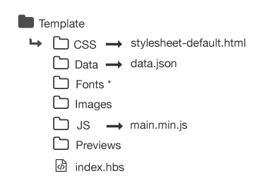

# Folio Template Library

This is a collection of portfolio templates used by [Folio](https://myfolioapp.herokuapp.com) - the Github pages portfolio generator. Each template is responsive and should display an about section, project section and social media link section. Each of the portfolios here can be viewed in the [Folio Library](https://myfolioapp.herokuapp.com/template-gallery) and easily used and managed through Folio. If you would like to contribute to this library make sure to follow the guidlines explained below.

## Features
* Modern and stylish templates
* Responsive designs
* Multiple theme colors available

### Content
[Structure](#structure)

# Structure
---

